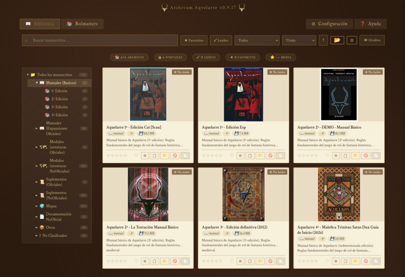

<p align="center">
  
  <br>
  <em>Collectio Manuscriptorum</em>
</p>

<h1 align="center">Bibliotheca Arcanorum</h1>

<p align="center">
  <strong>Open-source RPG book library manager</strong><br>
  Vanilla SPA catalog + cross-platform desktop app for creating and managing game document collections.
</p>

<p align="center">
  <a href="#features">Features</a> •
  <a href="#architecture">Architecture</a> •
  <a href="#getting-started">Getting Started</a> •
  <a href="#customizing-for-any-rpg">Customization</a> •
  <a href="#building-the-desktop-app">Building</a> •
  <a href="#license">License</a>
</p>

<p align="center">
  🌐 <a href="README_es.md">Leer en español</a>
</p>

---

## Overview

**Bibliotheca Arcanorum** is a complete system for organizing, cataloging, and browsing role-playing game document collections. It combines a lightweight static web catalog with a powerful desktop management application.

The project is designed to be **game-agnostic**: while it includes a dedicated theme for the [Aquelarre](https://en.wikipedia.org/wiki/Aquelarre_(role-playing_game)) RPG, the generic version can be customized for any game system — D&D, The One Ring, Call of Cthulhu, or your own homebrew setting.

### What's included

| Component | Description |
|---|---|
| 🌐 **Generic web catalog** (`webs/web_BibliothecaArcanorum/`) | Vanilla JS SPA — no frameworks, no backend, no build step. Works from any HTTP server. |
| 🎭 **Themed web catalog** (`webs/web_Aquelarre/`) | Same engine, themed for the Aquelarre RPG with custom branding, splash, and community credits. |
| 🖥️ **Desktop manager** (`tools/Gestor_biblioteca/`) | Python/Tkinter app to create, edit, and maintain catalogs. Scan PDF directories, extract covers, manage metadata. |

---

## Features

### Web Catalog (SPA)

- **100% static** — Pure HTML/CSS/JS, no server, no database. Runs on any static file server or locally.
- **Directory tree** — Browse documents by folder structure with expand/collapse.
- **Grid / List view** — Toggle between card grid and compact list.
- **Search & filter** — Full-text search with type, edition, and confidence filters.
- **Detail panel** — Cover preview, metadata, personal notes, ratings, read status.
- **Favorites** — Bookmark documents for quick access.
- **Reading stats** — Track pages read, mark books as finished.
- **Dark / Light theme** — Persistent preference with system default detection.
- **Settings export/import** — Backup or transfer your favorites, ratings, and notes.
- **Offline-ready** — All data cached in LocalStorage.
- **Multi-language ready** — Catalog data supports any language.

### Desktop Manager (Gestor_biblioteca)

- **Full CRUD** — Add, edit, delete catalog entries with a rich form interface.
- **PDF scanner** — Scan a directory tree, detect new/moved/renamed/deleted files, review changes before applying.
- **Cover management** — Auto-associate cover images, upload custom covers, extract covers from PDFs, audio files (MP3, FLAC, OGG, M4A), and image files.
- **Cover search** — Index existing covers and auto-link them to matching items.
- **Import/Export** — Package and transfer catalog subsets with covers and PDFs via `.bibliotex` format.
- **Advanced deletion** — Per-directory deletion with configurable actions for entries, PDFs, covers, and subdirectories.
- **Drag & drop** — Move items between directories visually in the tree.
- **JSON export** — Generates `catalogo.js` ready for the web.
- **Backup rotation** — Automatic rotating backups of your catalog JSON.
- **Cross-platform builds** — Windows (.exe), macOS (.dmg), Linux (.AppImage) via PyInstaller + CI.

---

## Architecture

```
BibliothecaArcanorum/
├── webs/
│   ├── web_BibliothecaArcanorum/   ← Generic catalog (copy & customize)
│   │   ├── index.html              ← SPA shell (edit text, title, tabs)
│   │   ├── css/style.css           ← Shared styles
│   │   ├── js/
│   │   │   ├── app.js              ← Init & orchestration
│   │   │   ├── data.js             ← Data model & persistence
│   │   │   ├── tree.js             ← Directory tree
│   │   │   ├── card.js             ← Card grid & list renderers
│   │   │   ├── search.js           ← Search & filter logic
│   │   │   ├── detail.js           ← Item detail panel
│   │   │   └── settings.js         ← User preferences & export
│   │   ├── data/catalogo.js        ← Generated by Gestor_biblioteca
│   │   └── assets/                 ← Logos, splash, placeholders
│   │
│   └── web_Aquelarre/              ← Aquelarre-themed variant
│       └── (same JS/CSS, different index.html, logo, splash)
│
├── tools/
│   └── Gestor_biblioteca/          ← Python/Tkinter desktop app
│       ├── main.py                 ← Entry point
│       ├── build.spec              ← PyInstaller spec
│       ├── requirements.txt
│       ├── src/
│       │   ├── app.py              ← Main window & orchestration
│       │   ├── models.py           ← Item dataclass
│       │   ├── catalog.py          ← JSON load/save
│       │   ├── scanner.py          ← Filesystem scanner
│       │   ├── portada_mgr.py      ← Cover image management
│       │   ├── portadas_extract_dialog.py  ← PDF/audio cover extraction
│       │   ├── portada_search_dialog.py    ← Cover auto-link
│       │   ├── scan_dialog.py      ← Scan review dialog
│       │   ├── path_setup_dialog.py
│       │   ├── settings_view.py
│       │   └── views/              ← list_view, detail_view, help_view
│       └── scripts/                ← Build scripts (Win/Mac/Linux)
│
└── src/                            ← Shared resources
    └── logo.svg
```

### How it all connects

```
┌──────────────────┐     builds JSON      ┌──────────────────────┐
│  Gestor_biblioteca│ ──────────────────→  │  data/catalogo.js    │
│  (desktop app)    │   (export JS file)   │                      │
└──────────────────┘                      └──────────┬───────────┘
                                                      │ loaded by
                                                      ▼
                                           ┌──────────────────────┐
                                           │  Web Catalog (SPA)   │
                                           │  (any web server)    │
                                           └──────────────────────┘
```

The desktop app generates a `catalogo.js` file that the web catalog loads as a script. No API, no database — just a static JS object.

---

## Getting Started

### Quick start with the web catalog

1. Clone this repository:
   ```bash
   git clone https://github.com/your-username/BibliothecaArcanorum.git
   ```
2. Open `webs/web_Bibliotheca_Arcanorum/index.html` directly in your browser — no server needed.

> The web catalog is a **static SPA** (HTML/CSS/JS) that loads its data from a `<script>` tag. It works with `file://` protocol out of the box. To create your own catalog, use the desktop manager.

### Using the desktop manager

**Option A — Pre-built binaries (recommended):**  
Download the latest release for your platform from the [Releases](https://github.com/carlymx/BibliothecaArcanorum/releases) page — no Python installation required.

**Option B — Run from source:**

Requires **Python 3.8+**.

```bash
cd tools/Gestor_biblioteca

# (Optional) Create and activate a virtual environment
python3 -m venv venv
source venv/bin/activate    # Linux/macOS
# venv\Scripts\activate     # Windows

pip install -r requirements.txt
python main.py
```

Helper scripts that automate the venv setup are also provided:
- Linux/macOS: `run.sh`
- Windows: `run_win.bat`

The app will guide you through the initial path setup (PDF library root, cover images directory, web root).

---

## Customizing for any RPG

The generic catalog (`web_BibliothecaArcanorum`) is designed to be a **template**. To adapt it for a different RPG:

1. **Copy** `webs/web_BibliothecaArcanorum/` to a new directory.
2. **Replace** `assets/icons/logo.svg` and `assets/portada_web.png` with your own branding.
3. **Edit** `index.html` to change the page title, splash text, and tab labels.
4. **Generate** your catalog with Gestor_biblioteca, setting the `juego` field to your game's name.
5. **Serve** the customized web from any static HTTP server.

> **Example variants**: D&D, The One Ring, Call of Cthulhu, Pathfinder, Warhammer Fantasy, Cyberpunk RED, or even non-game document collections.

Only `index.html` and the `assets/` folder need changes — all 7 JavaScript modules are shared.

---

## Building the desktop app

Pre-built binaries are available on the [Releases](https://github.com/your-username/BibliothecaArcanorum/releases) page. To build from source:

### Prerequisites

- **Python 3.8+**
- **Poppler utils** (`pdftoppm`) — for cover extraction from PDFs
  - Linux: `sudo apt install poppler-utils`
  - macOS: `brew install poppler`
  - Windows: bundled automatically in the build script

### Build with PyInstaller

```bash
cd tools/Gestor_biblioteca
pip install -r requirements.txt pyinstaller
pyinstaller build.spec
```

This produces:
- **Linux**: `dist/Gestor_biblioteca` (use `scripts/build-linux.sh` for AppImage)
- **macOS**: `dist/Gestor_biblioteca.app` (use `scripts/build-macos.sh` for .dmg)
- **Windows**: `dist/Gestor_biblioteca.exe` (use `scripts/build-windows.ps1` for one-file .exe)

### Automated builds

The repository includes a GitHub Actions workflow (`.github/workflows/build.yml`) that builds all three platforms on every version tag push.

---

## Tech stack

| Layer | Technology |
|---|---|
| **Web frontend** | Vanilla JavaScript (ES6), CSS3, HTML5 |
| **Desktop app** | Python 3, Tkinter, Pillow, mutagen, sv-ttk |
| **External tools** | pdftoppm (poppler-utils), appimagetool, create-dmg |
| **CI/CD** | GitHub Actions |
| **Packaging** | PyInstaller |

The web has **zero dependencies** — no npm, no build step, no frameworks, no CDN. Everything is hand-written JS.

---

## Related projects

- [Sun-Valley-ttk-theme](https://github.com/rdbende/Sun-Valley-ttk-theme) — Modern Tkinter theme used by Gestor_biblioteca
- [poppler](https://poppler.freedesktop.org/) — PDF rendering library (pdftoppm)
- [mutagen](https://mutagen.readthedocs.io/) — Audio metadata library for cover extraction

---

## License

This project is licensed under the GNU General Public License v3.0 — see the [LICENSE](LICENSE) file for details.

*Aquelarre is a registered trademark of Ricard Ibáñez. This project is not affiliated with or endorsed by the author.*
